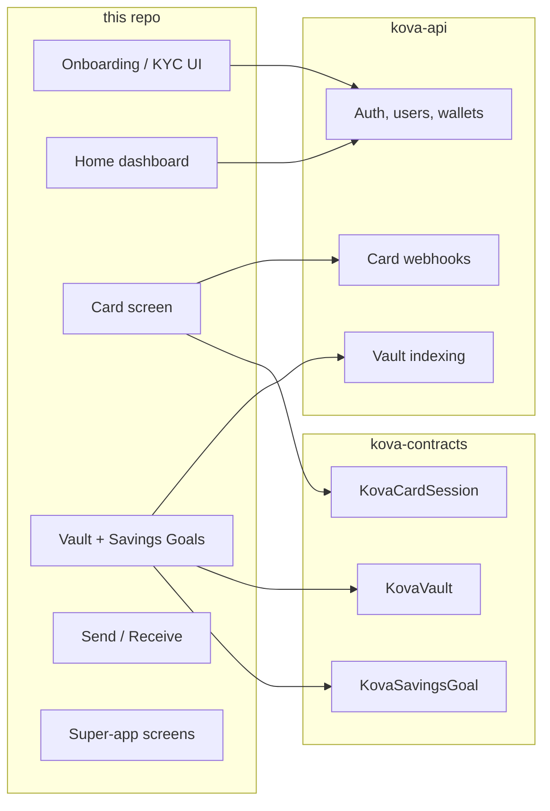
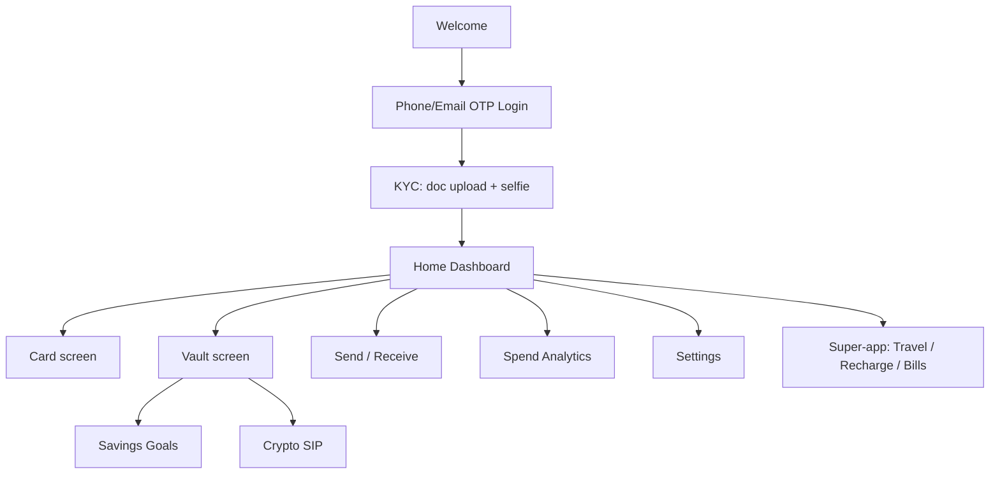
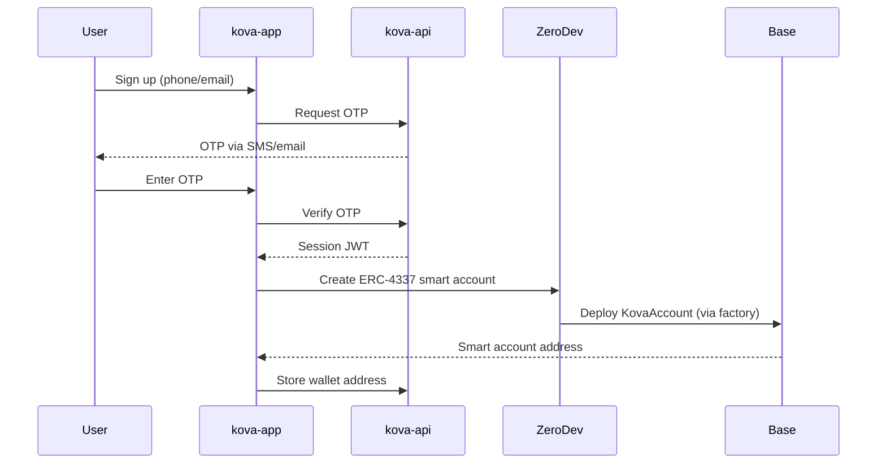
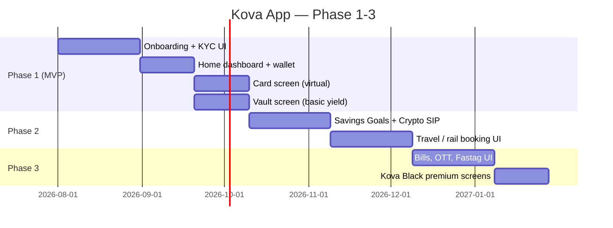

# kova-app

React Native (Expo Router) mobile app for **Kova** — an onchain neobank on Base. This repo is the client: onboarding/KYC, wallet + card UI, vault + savings goals, spend analytics, and the super-app layer (travel, recharges, bills).

## What lives here vs. elsewhere



## Screen map (Phase 1 target — 15-16 screens per the Master Brief)



## Auth + wallet creation flow (target)



## Stack
- Expo + Expo Router, TypeScript
- Zustand for state
- viem + ZeroDev SDK for onchain interactions (account creation, session keys)
- Tamagui or NativeWind for UI, Reanimated for micro-interactions (per design brief)

## Roadmap (this repo's slice of the Master Brief)



## Getting started
```bash
npm install
npm start
```

## Status
Empty scaffold — screens above are the target, not yet built. See [Immediate next steps](#) below for what's in progress.
